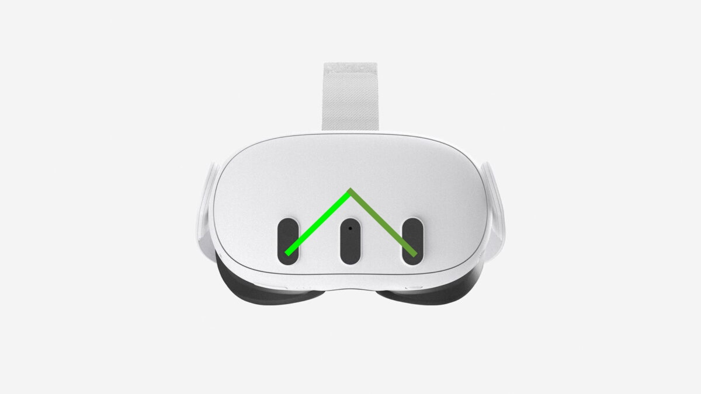
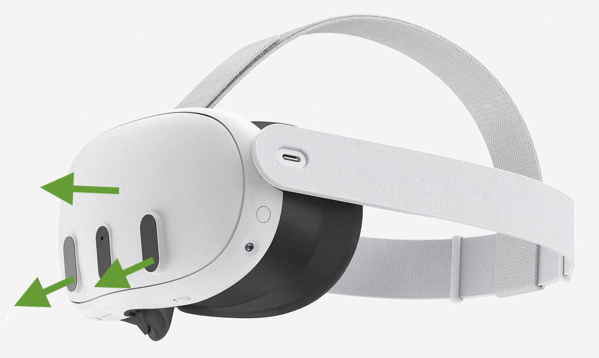

# Camera intrinsics

## Authors:

- Rik Cabanier cabanier@meta.com

## Introduction

This document describes a proposal to the WebRTC WG. At this stage, this proposal has not been accepted by the WG.

Each camera on a device has a certain set of intrinsic parameters which describe the camera's projection model. These parameters are also used to correct lens distortion.
Not all cameras or operating systems expose these parameters to applications. This proposal is to add a new API to the WebRTC API to expose these parameters to the site when available.

## Goals

* Expose parameters similar to [LENS_POSE_TRANSLATION](https://developer.android.com/reference/android/hardware/camera2/CameraCharacteristics#LENS_POSE_TRANSLATION) and  [LENS_POSE_ROTATION](https://developer.android.com/reference/android/hardware/camera2/CameraCharacteristics#LENS_POSE_ROTATION) to Web applications.
<!--
[LENS_INTRINSIC_CALIBRATION](https://developer.android.com/reference/android/hardware/camera2/CameraCharacteristics#LENS_INTRINSIC_CALIBRATION) and [LENS_DISTORTION](https://developer.android.com/reference/android/hardware/camera2/CameraCharacteristics#LENS_DISTORTION) to Web applications.
-->
This should allow applications to use the camera intrinsics to map the camera feed to the correct perspective for each eye in a WebXR application.

Example of the camera location:


Example of the camera orientation:


## Non-goals

* Expose all the other camera properties
* Mandate that these parameters are available on all devices

## Camera intrinsics API

### Metadata

The API extends the [MediaTrackSettings](https://w3c.github.io/mediacapture-main/#media-track-settings) dictionary with the following properties:

```idl

partial dictionary MediaTrackSettings {
  DOMPointReadOnly lensTranslation;
  DOMPointReadOnly lensRotation;
};

```

| Name | Description |
|------|-------------|
| lensTranslation | The translation as a 3d vector of the camera from the center of the device's screen |
| lensRotation | The rotation as a quaternion of the camera from the center of the device's screen |

## Example

```html
<!DOCTYPE html>
<html lang="en">
<head>
    <meta charset="UTF-8">
    <meta name="viewport" content="width=device-width, initial-scale=1.0">
    <title>Camera MediaTrackSettings Demo</title>
    <style>
        * {
            box-sizing: border-box;
            margin: 0;
            padding: 0;
        }

        body {
            font-family: -apple-system, BlinkMacSystemFont, 'Segoe UI', Roboto, Oxygen, Ubuntu, Cantarell, sans-serif;
            background: linear-gradient(135deg, #667eea 0%, #764ba2 100%);
            min-height: 100vh;
            padding: 20px;
        }

        .container {
            max-width: 1200px;
            margin: 0 auto;
        }

        h1 {
            color: white;
            text-align: center;
            margin-bottom: 30px;
            font-size: 2.5em;
            text-shadow: 2px 2px 4px rgba(0, 0, 0, 0.3);
        }

        .content {
            display: grid;
            grid-template-columns: 1fr 1fr;
            gap: 20px;
        }

        .panel {
            background: white;
            border-radius: 10px;
            padding: 25px;
            box-shadow: 0 10px 30px rgba(0, 0, 0, 0.3);
        }

        h2 {
            color: #667eea;
            margin-bottom: 20px;
            font-size: 1.5em;
            border-bottom: 2px solid #667eea;
            padding-bottom: 10px;
        }

        .camera-list {
            list-style: none;
        }

        .camera-item {
            padding: 15px;
            margin-bottom: 10px;
            background: #f7f7f7;
            border-radius: 5px;
            cursor: pointer;
            transition: all 0.3s ease;
            border: 2px solid transparent;
        }

        .camera-item:hover {
            background: #e8e8e8;
            transform: translateX(5px);
        }

        .camera-item.active {
            background: #667eea;
            color: white;
            border-color: #764ba2;
        }

        .camera-label {
            font-weight: 600;
            margin-bottom: 5px;
        }

        .camera-id {
            font-size: 0.85em;
            opacity: 0.7;
            font-family: monospace;
        }

        .settings-container {
            max-height: 600px;
            overflow-y: auto;
        }

        .settings-table {
            width: 100%;
            border-collapse: collapse;
        }

        .settings-table th,
        .settings-table td {
            padding: 12px;
            text-align: left;
            border-bottom: 1px solid #e0e0e0;
        }

        .settings-table th {
            background: #f7f7f7;
            font-weight: 600;
            color: #667eea;
            position: sticky;
            top: 0;
        }

        .settings-table tr:hover {
            background: #f9f9f9;
        }

        .settings-table td:first-child {
            font-weight: 500;
            color: #555;
        }

        .settings-table td:last-child {
            font-family: monospace;
            color: #333;
        }

        .video-preview {
            width: 100%;
            max-width: 100%;
            border-radius: 5px;
            margin-bottom: 20px;
            background: #000;
        }

        .error {
            background: #fee;
            border: 1px solid #fcc;
            color: #c33;
            padding: 15px;
            border-radius: 5px;
            margin-bottom: 15px;
        }

        .info {
            background: #e3f2fd;
            border: 1px solid #90caf9;
            color: #1976d2;
            padding: 15px;
            border-radius: 5px;
            margin-bottom: 15px;
        }

        .button {
            background: #667eea;
            color: white;
            border: none;
            padding: 10px 20px;
            border-radius: 5px;
            cursor: pointer;
            font-size: 1em;
            transition: background 0.3s ease;
            margin-bottom: 15px;
        }

        .button:hover {
            background: #764ba2;
        }

        .button:disabled {
            background: #ccc;
            cursor: not-allowed;
        }

        @media (max-width: 768px) {
            .content {
                grid-template-columns: 1fr;
            }
        }
    </style>
</head>
<body>
    <div class="container">
        <h1>📹 Camera MediaTrackSettings Demo</h1>

        <div class="content">
            <div class="panel">
                <h2>Available Cameras</h2>
                <button class="button" id="requestPermission">Request Camera Permission</button>
                <div id="errorContainer"></div>
                <ul class="camera-list" id="cameraList"></ul>
            </div>

            <div class="panel">
                <h2>Camera Settings & Preview</h2>
                <video class="video-preview" id="videoPreview" autoplay playsinline muted></video>
                <div class="settings-container">
                    <table class="settings-table">
                        <thead>
                            <tr>
                                <th>Setting</th>
                                <th>Value</th>
                            </tr>
                        </thead>
                        <tbody id="settingsBody">
                            <tr>
                                <td colspan="2" style="text-align: center; color: #999;">
                                    Select a camera to view its settings
                                </td>
                            </tr>
                        </tbody>
                    </table>
                </div>
            </div>
        </div>
    </div>

    <script>
        let currentStream = null;
        let devices = [];

        const cameraList = document.getElementById('cameraList');
        const settingsBody = document.getElementById('settingsBody');
        const videoPreview = document.getElementById('videoPreview');
        const errorContainer = document.getElementById('errorContainer');
        const requestPermissionBtn = document.getElementById('requestPermission');

        // Request camera permission
        requestPermissionBtn.addEventListener('click', async () => {
            try {
                errorContainer.innerHTML = '';
                // Request permission by getting a stream
                const stream = await navigator.mediaDevices.getUserMedia({ video: true });
                // Stop the stream immediately after getting permission
                stream.getTracks().forEach(track => track.stop());
                // Load the camera list
                await loadCameras();
                requestPermissionBtn.style.display = 'none';
            } catch (error) {
                showError('Permission denied or error accessing camera: ' + error.message);
            }
        });

        // Load available cameras
        async function loadCameras() {
            try {
                errorContainer.innerHTML = '';
                devices = await navigator.mediaDevices.enumerateDevices();
                const videoDevices = devices.filter(device => device.kind === 'videoinput');

                if (videoDevices.length === 0) {
                    showInfo('No cameras found on this device.');
                    return;
                }

                cameraList.innerHTML = '';

                videoDevices.forEach((device, index) => {
                    const li = document.createElement('li');
                    li.className = 'camera-item';
                    li.dataset.deviceId = device.deviceId;

                    const label = device.label || `Camera ${index + 1}`;

                    li.innerHTML = `
                        <div class="camera-label">${label}</div>
                        <div class="camera-id">${device.deviceId.substring(0, 20)}...</div>
                    `;

                    li.addEventListener('click', () => selectCamera(device.deviceId, li));
                    cameraList.appendChild(li);
                });

                showInfo(`Found ${videoDevices.length} camera(s). Click on a camera to view its settings.`);
            } catch (error) {
                showError('Error enumerating devices: ' + error.message);
            }
        }

        // Select and display camera settings
        async function selectCamera(deviceId, element) {
            try {
                errorContainer.innerHTML = '';

                // Stop previous stream if exists
                if (currentStream) {
                    currentStream.getTracks().forEach(track => track.stop());
                }

                // Remove active class from all items
                document.querySelectorAll('.camera-item').forEach(item => {
                    item.classList.remove('active');
                });

                // Add active class to selected item
                element.classList.add('active');

                // Get new stream with specific device
                const constraints = {
                    video: {
                        deviceId: { exact: deviceId }
                    }
                };

                currentStream = await navigator.mediaDevices.getUserMedia(constraints);

                // Show video preview
                videoPreview.srcObject = currentStream;

                // Get track settings
                const videoTrack = currentStream.getVideoTracks()[0];
                const settings = videoTrack.getSettings();

                // Display settings
                displaySettings(settings);

            } catch (error) {
                showError('Error accessing camera: ' + error.message);
            }
        }

        // Display settings in table
        function displaySettings(settings) {
            settingsBody.innerHTML = '';

            // Sort settings by key for better readability
            const sortedKeys = Object.keys(settings).sort();

            sortedKeys.forEach(key => {
                const value = settings[key];
                const tr = document.createElement('tr');

                const tdKey = document.createElement('td');
                tdKey.textContent = key;

                const tdValue = document.createElement('td');

                // Format value based on type
                if (typeof value === 'object' && value !== null) {
                    tdValue.textContent = JSON.stringify(value);
                } else if (typeof value === 'boolean') {
                    tdValue.textContent = value ? '✓ true' : '✗ false';
                } else {
                    tdValue.textContent = value;
                }

                tr.appendChild(tdKey);
                tr.appendChild(tdValue);
                settingsBody.appendChild(tr);
            });
        }

        // Show error message
        function showError(message) {
            errorContainer.innerHTML = `<div class="error">${message}</div>`;
        }

        // Show info message
        function showInfo(message) {
            errorContainer.innerHTML = `<div class="info">${message}</div>`;
        }

        // Clean up on page unload
        window.addEventListener('beforeunload', () => {
            if (currentStream) {
                currentStream.getTracks().forEach(track => track.stop());
            }
        });

        // Check if getUserMedia is supported
        if (!navigator.mediaDevices || !navigator.mediaDevices.getUserMedia) {
            showError('getUserMedia is not supported in this browser.');
            requestPermissionBtn.disabled = true;
        }
    </script>
</body>
</html>
```
